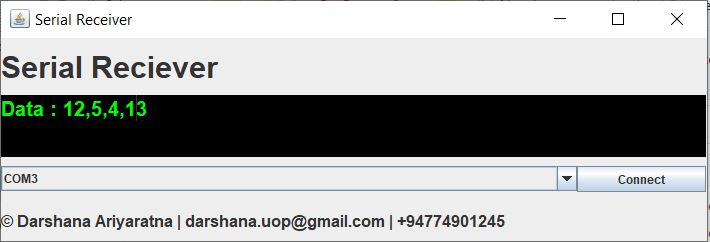

# serial-reciever
Serial port listner for PC (only for input data)

The figure bellow is showing the ui of the app

 
this can use for debug your hardware which is communicate with PC over serial port. 